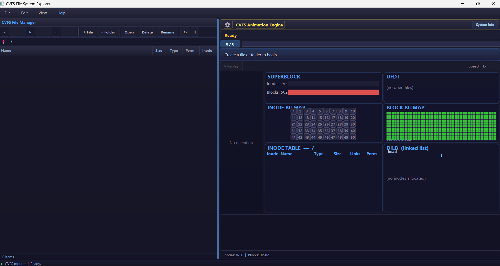
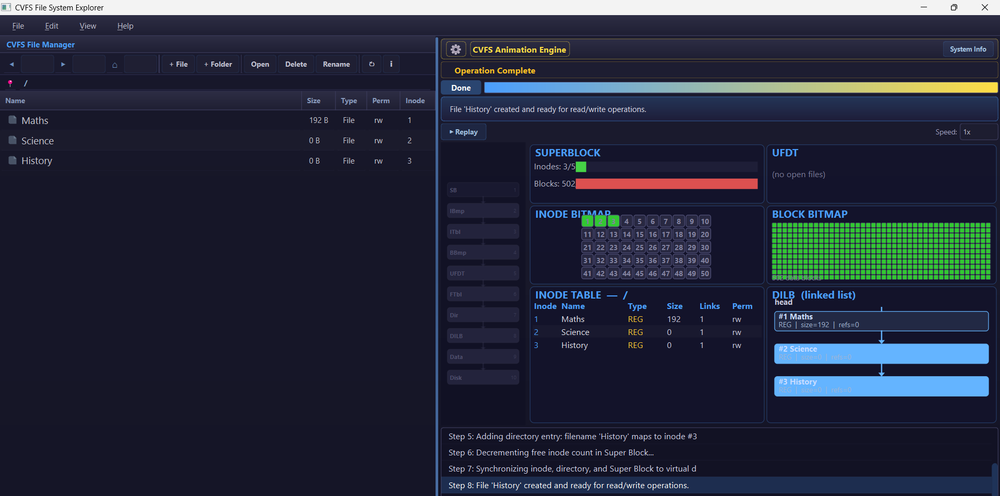

# CVFS — Customized Virtual File System

---

## Overview

CVFS is an educational Linux-inspired virtual file system built in C with a Qt-based graphical interface. It simulates how a real operating system manages files — inodes, super blocks, bitmaps, file descriptors, directories, and block allocation — all visualized in real time on a virtual 512 KB disk.

---

## Key Features

- **Full file system operations** — create, read, write, delete, rename, truncate files with permission-based access
- **Directory management** — create, remove, list, navigate directories with path resolution
- **Persistent storage** — ext2-inspired virtual disk image (`cvfs.img`) that saves state between sessions
- **Real-time visualization** — live inode bitmap (50 cells), block bitmap (502 cells), super block stats, and inode table viewer
- **Step-by-step animation** — every file operation broken into discrete animated steps at configurable speed (0.1x to 4x)
- **CLI shell** — terminal-based interface with commands mirroring Linux file system operations
- **Cross-platform GUI** — Qt-based interface running on Windows, Linux, and macOS
- **One-click Windows installer** — packaged with Inno Setup for easy installation

---

## Screenshots



*Main window showing the file explorer (left) and live visualization panel (right) with inode bitmap, block bitmap, and super block stats*



*CLI shell running file operations on the virtual disk*

<video src="screenshots/demo.mp4" controls width="800"></video>

---

## Why This Project is Different ⭐

Most file system simulators are purely theoretical or CLI-only. CVFS combines:

- **Live visualization** — instead of abstract concepts, you see inode and block allocation happen in real time on bitmap grids
- **Step-by-step animation** — each operation is decomposed into discrete internal steps (e.g., "Create File" becomes 7 steps), each highlighted on the relevant data structure
- **Dual interface** — both a modern Qt GUI for visual learners and a terminal CLI for hands-on practice
- **Persistent on-disk structures** — the virtual disk image uses actual ext2-inspired on-disk formats (DiskSuperBlock, DiskInode, DirEntry) that you can inspect
- **Real bug fixes** — the code evolved through real debugging of context-menu issues, block deallocation bugs, and animation formatting problems

---

## Architecture

### Internal Filesystem Architecture

The file system has three core layers:

**1. Super Block** — The disk header stored at Block 0. Contains total inode count (50), free inode count, total data blocks (502), free data blocks, first data block offset, block size (1024), and a magic number (0xEF53).

**2. Inode System** — Each file or directory has a `DiskInode` (128 bytes, stored on disk in Blocks 3–9) holding its filename, mode (type + permissions), size, link count, block count, and up to 4 direct block pointers. In memory, inodes are managed as a linked list (DILB — Disk Inode List Block) with additional runtime fields like buffer pointer and reference count.

**3. File Descriptor System** — When a file is opened, the UFDT (User File Descriptor Table, 50 entries) allocates a slot that points to a `FileTable` structure. The FileTable stores read/write offsets, access mode, and a back-pointer to the inode. This three-tier mapping (fd → file table → inode) mirrors real OS open file management.

**Disk Layout:**
```
Block 0:      Super Block
Block 1:      Block Bitmap (502 bits)
Block 2:      Inode Bitmap (56 bits)
Blocks 3–9:   Inode Table (56 inodes × 128 bytes)
Blocks 10–511: Data Blocks (502 blocks × 1024 bytes)
Total: 512 blocks × 1024 bytes = 512 KB
```

### Animation Engine ⭐

The animation engine in `cvfs_wrapper.cpp` wraps every CVFS operation with step-by-step visualization:

- Each operation is divided into logical steps (e.g., Create File = allocate inode → write inode → allocate block → write block → update bitmap → update super block)
- Each step fires a signal with a description message and a target index for highlighting the relevant bitmap cell
- The GUI receives these signals and highlights the appropriate cell in the inode or block bitmap grid
- A speed slider (0.1x to 4x) controls playback timing
- An operation log on the right panel shows the textual description of each step

### Persistent Storage

The virtual disk is stored as a binary file (`cvfs.img`) in the same directory as the executable. On first launch, if the file does not exist, a fresh 512 KB disk is initialized with empty super block, cleared bitmaps, and an empty inode table with a root directory entry. Every write operation updates the disk image immediately.

### Filesystem Workflows

| Operation | Internal Steps |
|-----------|---------------|
| **Create File** | Allocate inode bitmap slot → Initialize inode → Allocate data block → Write directory entry → Update super block |
| **Delete File** | Read inode → Free data blocks → Free inode bitmap slot → Remove directory entry → Update super block |
| **Open File** | Find inode by name → Allocate UFDT entry → Create FileTable → Set mode/offsets |
| **Write File** | Seek to offset → Allocate blocks if needed → Copy data to buffer → Sync to disk blocks → Update size |
| **Read File** | Find UFDT entry → Calculate offset → Read from inode buffer |
| **Truncate File** | Free all data blocks → Clear buffer → Zero inode size → Update bitmaps |

### GUI Overview

The main window is split into two panels:

- **Left Panel (File Manager):** Directory tree (QTreeView), file list table with columns (Name, Size, Type, Permission, Inode), toolbar with +File, +Folder, Delete, Rename, Properties buttons, and navigation controls
- **Right Panel (Visualization):** Super Block info card (total/free inodes and blocks), Inode Bitmap grid (6x9 + 1 spare), Block Bitmap grid (scrollable), Inode Table viewer (name, size, type, permission, link count), and Operation Log with speed slider

---

## Technologies Used

| Technology | Purpose |
|------------|---------|
| **C (C11)** | Core file system engine (CVFS.cpp) |
| **C++ (C++17)** | Qt GUI application |
| **Qt 6** | Cross-platform GUI framework (Widgets, Core, Gui) |
| **CMake 3.16+** | Build system generator |
| **Inno Setup** | Windows installer |
| **GitHub Actions** | CI/CD — auto build & package |
| **windeployqt** | Qt DLL bundling for Windows |
| **Emscripten** | WebAssembly compilation (optional) |

---

## Data Structures Used

### In-Memory Structures

- **SUPERBLOCK** — `TotalInodes`, `FreeInode`
- **INODE** — `FileName[50]`, `InodeNumber`, `FileSize`, `FileActualSize`, `FileType`, `Buffer*`, `LinkCount`, `ReferenceCount`, `permission`, `next*`
- **FILETABLE** — `readoffset`, `writeoffset`, `count`, `mode`, `ptrinode*`
- **UFDT** — `ptrfiletable*` (array of 50)

### On-Disk Structures

- **DiskSuperBlock** — `s_inodes_count`, `s_free_inodes_count`, `s_blocks_count`, `s_free_blocks_count`, `s_first_data_block`, `s_block_size`, `s_magic`, `reserved[996]`
- **DiskInode** — `i_filename[48]`, `i_mode`, `i_size`, `i_links_count`, `i_blocks_count`, `i_block[4]`, `i_reserved[48]`
- **DirEntry** — `d_inode`, `d_name[59]`, `d_type`

---

## Project Structure

| File/Directory | Purpose |
|----------------|---------|
| `CVFS.h` | Main header — all structures and function definitions |
| `CVFS.cpp` | Core implementation (~2500 lines) |
| `FileInfo.h/.cpp` | File metadata helpers |
| `cvfs_cli.cpp` | Terminal-based shell |
| `cvfs_original.cpp` | Original CLI (pre-Qt) |
| `main.cpp` | Qt application entry point |
| `mainwindow.h/.cpp` | Main window with menus and toolbar |
| `filemanagerpanel.h/.cpp` | File explorer with tree/table views |
| `filepropertydialog.h/.cpp` | Properties dialog |
| `newfiledialog.h/.cpp` | New file dialog |
| `cvfs_wrapper.h/.cpp` | C-to-C++ wrapper + animation engine |
| `cvfsmodel.h/.cpp` | Qt Model/View tree model |
| `helpdialog.h/.cpp` | Help dialog |
| `CMakeLists.txt` | Build configuration |
| `.github/workflows/build.yml` | GitHub Actions CI/CD |
| `cmake/toolchain_wasm.cmake` | Emscripten toolchain |
| `installer/CVFS_Setup.iss` | Inno Setup script |
| `scripts/package_windows.bat` | Windows packaging script |

---

## Installation

### Windows (One-Click Installer)

1. Go to the **Actions** tab of this repository
2. Click the latest successful run (green checkmark)
3. Scroll down to **Artifacts**
4. Click **CVFS_Setup-Windows** to download the ZIP
5. Extract and run `CVFS_Setup.exe`

### Build from Source

```bash
# Prerequisites: CMake 3.10+, C++17 compiler, Qt 6 (optional)

cmake -B build -DCMAKE_BUILD_TYPE=Release
cmake --build build --config Release --parallel

./build/cvfs_gui        # Linux/macOS
build/cvfs_gui.exe      # Windows
```

---

## Usage

### GUI Mode

- **Right-click** in the file list → New File, New Folder, Delete, Rename, Properties
- **Double-click** a file to view its contents
- **Speed slider** (bottom-right) controls animation speed
- **Watch** the right panel update live as you perform operations

### CLI Mode

```
create <name> <perm>     Create file (1=READ, 2=WRITE, 3=RW)
open <name> <mode>       Open a file
write <fd> <data>        Write data to a file
read <fd> <size>         Read from a file
close <name>             Close a file
rm <name>                Delete a file
ls                       List directory contents
stat <name>              Show file metadata
truncate <name>          Empty a file
mkdir <name>             Create directory
rmdir <name>             Remove directory
cd <path>                Change directory
help                     Show all commands
exit                     Quit
```

---

## Educational Value

CVFS makes abstract OS filesystem concepts tangible by letting you:

- **See** inode allocation/deallocation happen live on a bitmap grid
- **Watch** data blocks get reserved and freed as files are created and deleted
- **Trace** how file descriptors map to file tables to inodes (fd → file table → inode)
- **Understand** the super block's role as the filesystem metadata hub
- **Follow** step-by-step animations that decompose operations like "Create File" into 7 discrete internal steps
- **Experiment** with permissions, directories, and file operations in a sandboxed environment
- **Inspect** on-disk structures (DiskSuperBlock, DiskInode, DirEntry) that mirror real ext2 formats

---

## Challenges Faced

- **Context menu not working** — right-clicking a file did nothing because `onCustomContextMenu` never called `setCurrentIndex()`, so action handlers used stale selection state
- **Double-click opening wrong file** — `onItemDoubleClicked` correctly identified the inode but then called `onOpen()` which re-fetched from `currentIndex()` instead of the clicked index
- **Raw format specifiers in animation** — step messages displayed literal `%d` and `%s` because `fireStep()` was called with printf-style strings but no arguments; fixed by adding a variadic `fireStepF()` helper
- **Data blocks not freed on delete** — deleting a file never freed its data blocks, causing gradual disk exhaustion; fixed by reading the DiskInode and calling `free_data_block()` on each block
- **Wrong block numbers in animation** — delete/truncate animations highlighted blocks 0,1,2,3 instead of actual file blocks because the loop used the counter variable instead of DiskInode block numbers

---

## Learning Outcomes

- Deep understanding of Unix/Linux filesystem internals (inodes, super blocks, bitmaps, block allocation)
- Experience with C system programming and memory management (heap buffers, linked lists, bit manipulation)
- Qt Model/View architecture for displaying hierarchical and tabular data
- C-to-C++ interop — wrapping a C library for use in a C++ Qt application
- Signal/slot pattern for real-time visualization and animation
- CMake build system configuration with optional GUI support
- GitHub Actions CI/CD — cross-platform build, testing, and packaging
- Inno Setup installer creation for Windows distribution
- Debugging real-world bugs — context menu, block deallocation, format string issues

---

## Future Enhancements

- **Indirect block pointers** — support larger files by implementing single/double indirect blocks
- **File permissions** — full Unix-style rwx permission system with ownership
- **Symlinks and hard links** — complete link count management
- **Disk quota enforcement** — limit file system usage
- **Drag-and-drop** — import/export files between host OS and virtual disk
- **WebAssembly build** — run CVFS in a browser via Emscripten
- **Undo/redo** — operation history with rollback
- **Search** — find files by name or content within the virtual disk

---

## License

Distributed under the MIT License.

---

## Author

**Janhavi Kolamkar**
